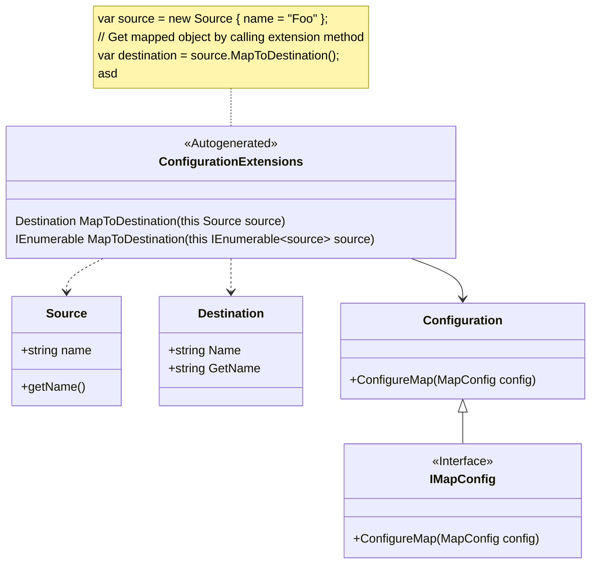

<div align="center">

[](https://www.nuget.org/packages/dotMap)
[](LICENSE)
[](https://www.nuget.org/packages/dotMap)


# dotMap for .NET

Convention-based object-to-object compile time mapper for .NET.

It simplifies the process of transferring data between objects, reducing the need for manual mapping code. 
<a href="https://github.com/devexperts/dotmap">dotMap</a> leverages a set of conventions to map properties 
between source and destination types, minimizing configuration while maintaining flexibility. 
This library is particularly useful in scenarios where objects have similar structures, 
such as in data transfer objects (DTOs) and domain models, enabling developers 
to focus more on business logic rather than boilerplate mapping code.

<a href="https://github.com/devexperts/dotmap">dotMap</a> is ideal for developers looking for a streamlined and 
reliable solution for object mapping in .NET applications, improving code maintainability and reducing 
the likelihood of errors during data transfer operations.

</div>

## Table of contents

- [Key features](#key-features)
- [Installation](#installation)
- [Usage example](#usage-example)
- [How does it work?](#how-does-it-work)
- [Tutorials](#tutorials)
  - [Configuration variations](#configuration-variations)
    - [Declarative configuration](#declarative-configuration) 
    - [Imperative configuration](#imperative-configuration)
  - [Multiple configurations](#multiple-configurations)
  - [Use of naming conversion](#use-of-naming-conversion)
    - [List of supported naming conversions](#list-of-supported-naming-conversions)
  - [Choose members to map and ignore](#choose-members-to-map-and-ignore)
    - [Mapping mode](#mapping-mode)
    - [Ignore member](#ignore-member)
  - [Use of constructor](#use-of-constructor)
  - [Customize member value](#customize-member-value)
    - [Object customization](#object-customization)
    - [Per-member customization](#per-member-customization)
    - [Passing arguments](#passing-arguments)
  - [Handle lists and arrays](#handle-lists-and-arrays)
- [Methods](#methods)
  - [Map](#map)
  - [To](#to)
  - [From](#from)
  - [WithDestinationNamingConvention](#withdestinationnamingconvention)
  - [WithParameter](#withparameter)
  - [ConstructFrom](#constructfrom)
  - [Finally](#finally)
  - [ForMember](#formember)
  - [Ignore](#ignore)
  - [WithMappingMode](#withmappingmode)
- [Attributes](#attributes)
  - [MapTo](#mapto)
  - [MapFrom](#mapfrom)
  - [Ignore](#ignore)
  - [DestinationMembersNamingConvention](#destinationmembersnamingconvention)
  - [DestinationConstructorNamingConvention](#destinationconstructornamingconvention)
  - [DestMappingMode](#destmappingmode)
  - [SourceMappingMode](#sourcemappingmode)
- [Interfaces](#interfaces)
  - [IMapConfig](#imapconfig)
  - [IMappable](#imappable)
- [Roadmap](#roadmap)
- [License](#license)
- [Contribution](#contribution)
- [Contact](#contact)
 
## Key features
- **Convention-Based Mapping:** Automatically maps properties with matching names between source and destination objects.
- **Compile-Time Checking:** Ensures mappings are verified at compile time, reducing runtime errors.
- **Nested Mappings:** Supports deep object graphs, allowing complex objects to be mapped effortlessly.
- **Configurable:** Easily configurable to support value transformations, and meet object construction requirements.

## Installation

- Install [NuGet](http://docs.nuget.org/docs/start-here/installing-nuget), if not installed yet.
- Add [dotMap](https://www.nuget.org/packages/dotMap/) from the package manager console.

```
PM> Install-Package dotMap
```
 
- Alternatively, add dotMap from the .NET CLI.

```
dotnet add package dotMap
```

## Usage example

- Define map configuration
- Get instance of the class by calling automatically generated extension method that is unique for your object

```csharp
using FluentAssertions;
using Xunit;

public class Example
{
  [Fact]
  public void Test()
  {
    var source = new Source { Name = "Foo" };
    var destination = source.MapToDestination();
    // destination.Name has the same value as source.Name
    destination.Name.Should().Be(source.Name);
  }
  
  private class Configuration : IMapConfig
  {
    public void ConfigureMap(MapConfig config)
    {
      config
        .Map<Source>()
        .To<Destination>();
    }
  }
}

internal class Destination
{
  public string Name { get; set; }
}

public class Source
{
  public string Name { get; set; }
}
```

👉 Check more [examples](../Tests/dotMap.FunctionalTests) right in the source code.

## How does it work?

Once the map configuration is defined, `dotMap` generates new files with classes that provide extension methods 
for the `source` object that allow you to get an instance of the `target` object while preserving the `source` values 
based on the defined configuration.



Here is the code that is generated for the [previous example](#usage-example).

```csharp
namespace dotMap.Tests.Examples
{
  public static class Tests_ConfigurationExtensions
  {
    internal static dotMap.Tests.Examples.Destination MapToDestination(this dotMap.Tests.Examples.Source source)
    {
      var result = new dotMap.Tests.Examples.Destination()
      {
        Name = source.Name
      };
      return result;
    }

    internal static IEnumerable<dotMap.Tests.Examples.Destination> MapToDestination(this IEnumerable<dotMap.Tests.Examples.Source> source)
    {
      return source?.Select(item => item == null ? null : Tests_ConfigurationExtensions.MapToDestination(item));
    }
  }
}
```

## Tutorials

### Configuration variations

#### Declarative configuration

There are several mechanisms for defining a map configuration.
One is to define a configuration in a separate class by implementing the `ConfigureMap`'` method, as follows.

```csharp
private class Configuration : IMapConfig
{
  public void ConfigureMap(MapConfig config)
  {
    config
      .Map<Source>()
      .To<Destination>()
      .WithDestinationNamingConvention<PascalCaseConvention>();
  }
}
```

An alternative solution is to define the configuration directly in the object definition.

```csharp
internal class Destination : IMappable<Destination>
{
  public string Name { get; set; }
  
  public void ConfigureMap(MapConfig<Destination> map)
  {
    map
      .From<Source>()
      .WithDestinationNamingConvention<PascalCaseConvention>();
  }
}
```

#### Imperative configuration

The other way to define map configuration is to use attributes.

```csharp
[MapFrom(typeof(Source), DestinationMembersNamingConvention = typeof(PascalCaseConvention))]
internal class Destination
{
  public string? Name { get; set; }

  [Ignore]
  public int Year { get; set; }
}

public class Source
{
  public string? name { get; set; }
  public int year { get; set; }
}
```

### Multiple configurations

It is allowed to have multiple configurations.

Also, a single `source` object can be mapped to multiple `destination` objects.

```csharp
private class Configuration : IMapConfig
{
  public void ConfigureMap(MapConfig config)
  {
    config
      .Map<Source>()
      .To<Destination>();
    config
      .Map<Source>()
      .To<Destination2>()
      .Ignore(m => m.Year);
  }
}
```

Here is another example where attributes are used for the same purpose.

```csharp
[MapFrom(typeof(Source))]
[MapFrom(typeof(Source2))]
internal class Destination
{
  public string? Name { get; set; }
  // Ignore for all mappings
  [Ignore]
  public int Year { get; set;  }
  // Ignore for `Source2` mapping only
  [Ignore(For = typeof(Source2))]
  public decimal Cost { get; set; }
}
```

### Use of naming conversion

If member names of the `source` and `destination` objects match, the map configuration can be as simple as following.

```csharp
private class Configuration : IMapConfig
{
  public void ConfigureMap(MapConfig config)
  {
    config
      .Map<Source>()
      .To<Destination>();
  }
}
```

However, if the `source` object uses a different naming convention than the `destination` object, we need to specify 
the naming conversion rules to match object members between the objects.

```csharp
private class Configuration : IMapConfig
{
  public void ConfigureMap(MapConfig config)
  {
    config
      .Map<Source>()
      .To<Destination>()
      .WithDestinationNamingConvention<PascalCaseConvention>();
  }
}

internal class Destination
{
  public string? Name { get; set; }
}

public class Source
{
  public string? name { get; set; }
}
```

Another example is constructor parameters, which may differ between `source` and `destination` objects, 
so the naming conversion rule should be specified to match constructor parameters.

```csharp
[MapFrom(typeof(source),
  DestMappingMode = DestMappingMode.MapToConstructor,
  DestinationConstructorNamingConvention = typeof(CamelCaseConvention))]
internal class Destination
{
  public Destination(string firstName)
  {
    FirstName = firstName;
  }

  public string FirstName { get; }
}

public class source
{
  public string first_name { get; set; }
}
```

#### List of supported naming conversions

As long as `source` and `destination` objects use the same naming convention, it can be any.
However, if object member names need to be converted to a different naming convention to match, 
the naming conversion should be used.

The following naming conversions are built in and supported:
- CamelCase
- pascalCase
- snake_case

### Choose members to map and ignore

#### Mapping mode

You can choose which object members to map, such as properties, fields, and methods.
By default, properties and fields are mapped.

This behavior can be configured by specifying one of the `MappingMode`:
- `MapPropsAndFields` to map properties and fields only
- `MapMethods` to map methods only
- `MapAllMembers` to map properties, fields, and methods

```csharp
public void ConfigureMap(MapConfig config)
{
  config
    .Map<Source>()
    .To<Destination>()
    .WithMappingMode(SourceMappingMode.MapAllMembers);
}
```

Consider the following example where `SourceMappingMode` is set to map methods only.
Since `Source.GetCost()` is a method, and thus can be mapped, and has a matching member name of
which is a property of `Destination.GetCost`.

```csharp
private class Configuration : IMapConfig
{
  public void ConfigureMap(MapConfig config)
  {
    config
      .Map<Source>()
      .To<Destination>()
      // Source.GetCost() gets mapped to Destination.GetCost
      .WithMappingMode(SourceMappingMode.MapMethods);
  }
}

internal class Destination
{
  public int GetCost { get; set; }
}

public class Source
{
  public int GetCost() => 100;
}
```

#### Ignore member

If a particular member is not needed, it can be excluded from the map configuration so that its value is not copied.

```csharp
using FluentAssertions;
using Xunit;

private class Configuration : IMapConfig
{
  public void ConfigureMap(MapConfig config)
  {
    config
      .Map<Source>()
      // Name property gets value copied
      .To<Destination>()
      // Year property is ignored and will equal default value of 0
      .Ignore(m => m.Year);
  }
}

internal class Destination
{
  public string? Name { get; set; }
  public int Year { get; set;  }
}

public class Source
{
  public string? Name { get; set; }
  public int Year { get; set; }
}
```

## Use of constructor

If the object construction needs to pass an argument, use `ConstructFrom`.

This could also be used to adjust the value of the member. However, depending on the design requirements of an object, 
there are other approaches available. Read more in the [Customize member value](#customize-member-value) tutorial.

```csharp
using FluentAssertions;
using Xunit;

public class Example
{
  [Fact]
  public void Test()
  {
    var source = new Source { Name = "Foo", Year = 2024 };
    var destination = source.MapToDestination();
    destination.Name.Should().Be("Foo 2024");
  }

  private class Configuration : IMapConfig
  {
    public void ConfigureMap(MapConfig config)
    {
      config
        .Map<Source>()
        .To<Destination>()
        .ConstructFrom(source => new Destination($"{source.Name} {source.Year}"))
        .Ignore(m => m.Name);
    }
  }
}

internal class Destination(string name)
{
  public string Name { get; init; } = name;
}

public class Source
{
  public string Name { get; set; }
  public int Year { get; set; }
}
```

## Customize member value

### Object customization

Pass an action to the `Finally` method call to execute the logic required to adjust destination object.

```csharp
using FluentAssertions;
using Xunit;

public class Example
{
  [Fact]
  public void Test()
  {
    var source = new Source { Name = "Foo", Year = 2024 };
    var destination = source.MapToDestination();
    destination.Name.Should().Be("Foo 2024");
  }

  private class Configuration : IMapConfig
  {
    public void ConfigureMap(MapConfig config)
    {
      config
      .Map<Source>()
      .To<Destination>()
      .Finally((source, destination) => destination.Name = $"{source.Name} {source.Year}");
    }
  }
}

internal class Destination
{
  public string Name { get; set; }
}

public class Source
{
  public string Name { get; set; }
  public int Year { get; set; }
}
```

### Per-member customization

When a destination object change involves multiple member changes, it can be split to improve configuration readability
and simplify maintenance.

```csharp
using FluentAssertions;
using Xunit;

public class Example
{
  [Fact]
  public void Test()
  {
    var source = new Source { Name = "Foo", Year = 2024, Cost = 100 };
    var destination = source.MapToDestination();
    destination.Name.Should().Be("Bar");
    destination.Year.Should().Be(2023);
    destination.Cost.Should().Be(0);
  }

  internal class Configuration : IMapConfig
  {
    public void ConfigureMap(MapConfig config)
    {
      config
        .Map<Source>()
        .To<Destination>()
        .ForMember(d => d.Name, s => "Bar")
        .ForMember(d => d.Year, s => s.Year - 1)
        .ForMember(d => d.Cost, TransformCost);
    }

    // Note the class visibility access modifier, so `TransformCost` can be called
    public static decimal TransformCost(Source s) => 0;
  }
}

internal class Destination
{
  public string Name { get; set; }
  public int Year { get; set;  }
  public decimal Cost { get; set; }
}

public class Source
{
  public string Name { get; set; }
  public int Year { get; set; }
  public decimal Cost { get; set; }
}
```

### Passing arguments

While it's possible to have value transformation logic defined in the map configuration, it can be extended by 
accepting additional parameters. To implement this, `WithParameter` should be defined, listing the arguments to be 
passed to the map configuration, as follows.

```csharp
using FluentAssertions;
using Xunit;

public class Example
{
  [Fact]
  public void Test()
  {
    var source = new Source { Name = "Foo" };
    var destination = source.MapToDestination("Bar");
    destination.Name.Should().Be("Bar");
  }

  private class Configuration : IMapConfig
  {
    public void ConfigureMap(MapConfig config)
    {
      config
        .Map<Source>()
        .To<Destination>()
        .WithParameter<string>()
        .ConstructFrom((source, prm) => new Destination { Name = prm })
        .Ignore(m => m.Name);
    }
  }
}

internal class Destination
{
  public string Name { get; set; }
}

public class Source
{
  public string Name { get; set; }
}
```

In case of multiple parameters, the map configuration may look like the following.

```csharp
private class Configuration : IMapConfig
{
  public void ConfigureMap(MapConfig config)
  {
    config
      .Map<Source>()
      .To<Destination>()
      .WithParameter<(string name, int year)>()
      .ConstructFrom((source, args) => new Destination { Name = $"{args.name} {args.year}" })
      .Ignore(m => m.Name);
  }
}
```

## Handle lists and arrays

When a list of objects is being passed to the `MapToDestination` call, each item in the list is mapped according to the
map configuration.

```csharp
using FluentAssertions;
using Xunit;

public class Example
{
  [Fact]
  public void Test()
  {
    var sourceArray = new[]
    {
      new Source { Name = "Foo" },
      new Source { Name = "Bar" }
    };
    var destinationArray = sourceArray.MapToDestination();
    destinationArray.Select(d => d.Name).Should().ContainInOrder(sourceArray.Select(o => o.Name));
    
    var sourceList = new List<Source>
    {
      new() { Name = "Foo" },
      new() { Name = "Bar" }
    };
    var destinationList = sourceList.MapToDestination();
    destinationList.Select(d => d.Name).Should().ContainInOrder(sourceList.Select(o => o.Name));
  }

  private class Configuration : IMapConfig
  {
    public void ConfigureMap(MapConfig config)
    {
      config
      .Map<Source>()
      .To<Destination>();
    }
  }
}

internal class Destination
{
  public string Name { get; set; }
}

public class Source
{
  public string Name { get; set; }
}
```

## Methods

### Map

The `Map` method is used to specify the object to map.

```csharp
public void ConfigureMap(MapConfig config)
{
  config.Map<Source>().To<Destination>();
}
```

💡 See related [tutorial](#declarative-configuration).

### To

The `To` method is used to specify the object to map to.

```csharp
public void ConfigureMap(MapConfig config)
{
  config
    .Map<Source>()
    .To<Destination>();
}
```

💡 See related [tutorial](#declarative-configuration).

### From

The `From` method is used to specify the object to be mapped from.

```csharp
public void ConfigureMap(MapConfig config)
{
  config
    .Map<Destination>()
    .From<Source>();
}
```

💡 See related [tutorial](#declarative-configuration).

### WithDestinationNamingConvention

The `WithDestinationNamingConvention` method is used to specify naming convention rules to follow when attempting to 
identify matched members between `source` and `destination` objects.

```csharp
public void ConfigureMap(MapConfig config)
{
  config
    .Map<Source>()
    .To<Destination>()
    .WithDestinationNamingConvention<PascalCaseConvention>();
}
```

💡 See related [tutorial](#use-of-naming-conversion).

### WithParameter

The `WithParameter` method is used to specify an argument or list of arguments that must be passed to perform 
object mapping.

```csharp
public void ConfigureMap(MapConfig config)
{
  config
    .Map<Source>()
    .To<Destination>()
    .WithParameter<int>();
}
```

💡 See related [tutorial](#passing-arguments).

### ConstructFrom

The `ConstructFrom` method is used to specify how exactly the `destination` object should be created.

```csharp
public void ConfigureMap(MapConfig config)
{
  config
    .Map<Source>()
    .To<Destination>()
    .ConstructFrom(source => new Destination { Name = "Name always Foo" });
}
```

💡 See related [tutorial](#use-of-constructor).

### Finally

The `Finally` method is used to specify an action to be performed after the object is created.

```csharp
public void ConfigureMap(MapConfig config)
{
  config
    .Map<Source>()
    .To<Destination>()
    .Finally((source, destination) =>
    {
      source.Name = "Change source name";
      destination.Name = "Change destination name";
    });
}
```

💡 See related [tutorial](#object-customization).

### ForMember

The `ForMember` method is used to specify an action to be performed on a member during mapping.

```csharp
public void ConfigureMap(MapConfig config)
{
  config
    .Map<Source>()
    .To<Destination>()
    .ForMember(member => member.Name, sourceValue => $"Copied from {sourceValue}");
}
```

💡 See related [tutorial](#per-member-customization).

### Ignore

The `Ignore` method is used to specify a member to exclude from mapping.

```csharp
public void ConfigureMap(MapConfig config)
{
  config
    .Map<Source>()
    .To<Destination>()
    .Ignore(member => member.Name);
}
```

💡 See related [tutorial](#ignore-member).

### WithMappingMode

The `WithMappingMode` method is used to specify object member types to include in the mapping while excluding others.

```csharp
public void ConfigureMap(MapConfig config)
{
  config
    .Map<Source>()
    .To<Destination>()
    .WithMappingMode(SourceMappingMode.MapMethods);
}
```

💡 See related [tutorial](#mapping-mode).
 
## Attributes

### MapTo

The `[MapTo]` attribute is used to specify the object to map to.

```csharp
[MapTo(typeof(Destination))]
public class Source
{
  public string Name { get; set; }
}
```

💡 See related [tutorial](#declarative-configuration).

### MapFrom

The `[MapFrom]` attribute is used to specify the object to map from.

```csharp
[MapFrom(typeof(Source))]
internal class Destination
{
  public string Name { get; set; }
}
```

💡 See related [tutorial](#declarative-configuration).

### Ignore

The `[Ignore]` attribute is used to specify a member to exclude from mapping.

```csharp
[MapFrom(typeof(Source))]
internal class Destination
{
  public string Name { get; set; }
  [Ignore]
  public int Year { get; set; }
}
```

The `[Ignore]` attribute `[For]` is used to specify the type from which the member mapping should be excluded.

```csharp
[MapFrom(typeof(Source))]
internal class Destination
{
  public string Name { get; set; }
  [Ignore(For = typeof(Source))]
  public int Year { get; set; }
}
```

💡 See related [tutorial](#ignore-member).

### DestinationMembersNamingConvention

The `[DestinationMembersNamingConvention]` attribute is used to specify naming convention rules to follow when 
attempting to identify matching members between `source` and `destination` objects.

```csharp
[MapFrom(typeof(Source), DestinationMembersNamingConvention = typeof(PascalCaseConvention))]
internal class Destination
{
  public string Name { get; set; }
}
```

💡 See related [tutorial](#use-of-naming-conversion).

### DestinationConstructorNamingConvention

The `[DestinationConstructorNamingConvention]` attribute is used to specify naming convention rules that should be 
followed when attempting to resolve constructor parameters.

```csharp
[MapFrom(typeof(source),
  DestMappingMode = DestMappingMode.MapToConstructor,
  DestinationConstructorNamingConvention = typeof(CamelCaseConvention))]
internal class Destination
{
  public Destination(string firstName)
  {
    FirstName = firstName;
  }

  public string FirstName { get; }
}
```

💡 See related [tutorial](#use-of-naming-conversion).

### DestMappingMode

The `[DestMappingMode]` attribute is used to specify which members of the `destination` object should be mapped, 
such as properties, fields, and methods.

```csharp
[MapFrom(typeof(Source), DestMappingMode = DestMappingMode.MapToPropsAndFields)]
internal class Destination
{
  public string Name { get; set; }
}
```

💡 See related [tutorial](#mapping-mode).

### SourceMappingMode

The `[SourceMappingMode]` attribute is used to specify which members of the `source` object to map, such as properties,
fields, and methods.

```csharp
[MapTo(typeof(Destination), SourceMappingMode = SourceMappingMode.MapPropsAndFields )]
public class Source
{
  public string Name { get; set; }
}
```

💡 See related [tutorial](#mapping-mode).

## Interfaces

### IMapConfig

The `IMapConfig` interface declares the method that must be implemented to specify the map configuration.

```csharp
private class Configuration : IMapConfig
{
  public void ConfigureMap(MapConfig config)
  {
    config
      .Map<Source>()
      .To<Destination>();
  }
}
```

💡 See related [tutorial](#declarative-configuration).

### IMappable

The `IMappable` interface declares the method that must be implemented to specify the map configuration for the object.

```csharp
internal class Destination : IMappable<Destination>
{
  public string Name { get; set; }
  
  public void ConfigureMap(MapConfig<Destination> map)
  {
    map.From<Source>();
  }
}
```

💡 See related [tutorial](#declarative-configuration).

## Roadmap

- [ ] Add support for enumerable
- [ ] Add kebab naming support
- [ ] Add custom naming support

See [open issues](https://github.com/dotMap/issues) for a full list of proposed features (and known issues).

## License

Distributed under the MPL 2.0 License. See [LICENSE](LICENSE) for details.

## Contribution

Contributions are what make the open source community such an amazing place to learn, inspire, and create. Any contributions you make are greatly appreciated.

If you have a suggestion that would make this better, please fork the repo and create a pull request. You can also simply open an issue with the tag "enhancement".
Don't forget to give the project a star! Thanks again!

1. Fork the Project
2. Create your Feature Branch (`git checkout -b feature/AmazingFeature`)
3. Commit your Changes (`git commit -m 'Add some AmazingFeature'`)
4. Push to the Branch (`git push source feature/AmazingFeature`)
5. Open a Pull Request
